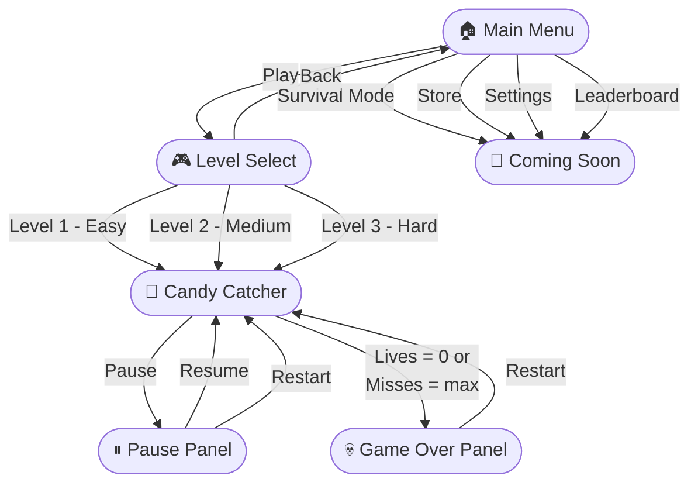
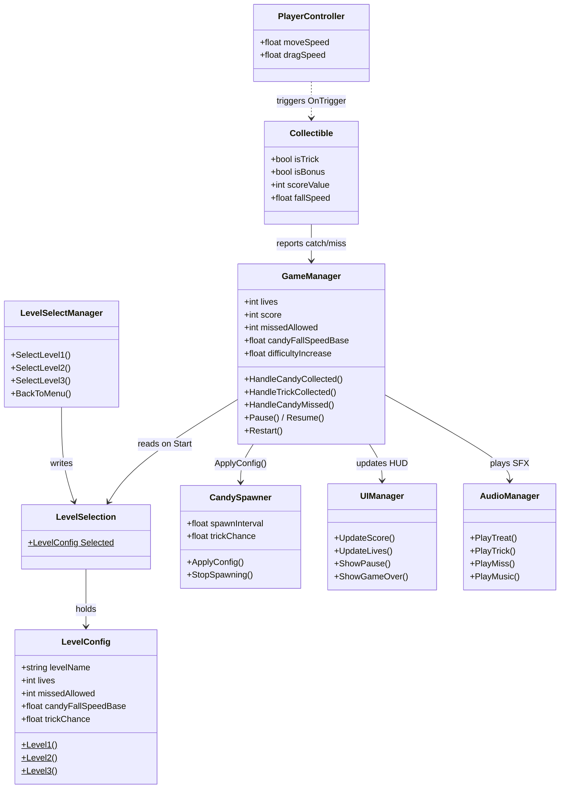
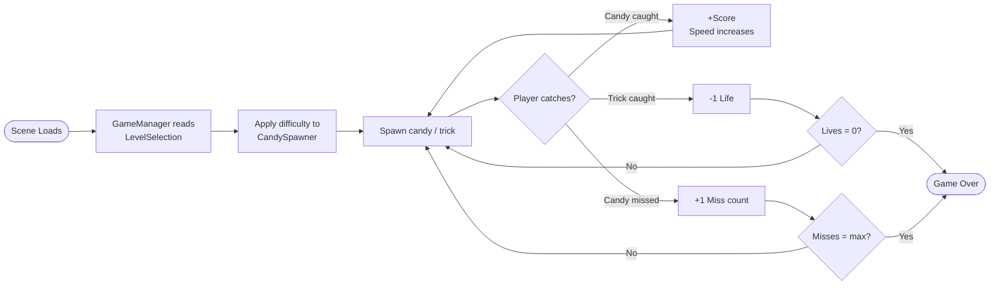

# 🍬 Candy Catchers

A fast-paced 2D arcade game built in Unity where you catch falling candy while dodging spooky trick objects. Choose your difficulty and see how long you can survive!

---

## Gameplay

Move the catcher left and right at the bottom of the screen to:
- **Catch candy** — earn points
- **Avoid tricks** (spooky bad candy) — lose a life if you catch one
- **Don't let candy fall** — too many misses and it's game over

The game gets faster and faster as you play. How long can you last?

### Controls
| Input | Action |
|---|---|
| `A` / `←` | Move left |
| `D` / `→` | Move right |
| Click & drag | Move to cursor position |
| `Escape` / Pause button | Pause game |

---

## Game Flow



### Level Difficulties

| | Level 1 — Easy | Level 2 — Medium | Level 3 — Hard |
|---|---|---|---|
| Lives | 3 | 3 | 2 |
| Max misses | 5 | 4 | 3 |
| Starting fall speed | 2.5 | 3.5 | 5.0 |
| Trick chance | 10% | 20% | 30% |
| Spawn rate | Slow | Normal | Fast |

---

## Project Setup

### Requirements
- **Unity 6** (6000.3.10f1 or later)
- **Unity Hub 3.x**

### Running the Project
1. Clone or download the repository
2. Open **Unity Hub** → **Open** → select the `CandyCatchersGame` folder
3. Unity will import all assets automatically (may take a minute on first open)
4. Open `Assets/Scenes/Main Menu.unity`
5. Press **Play**

> The `Library/`, `Temp/`, and `Logs/` folders are auto-generated by Unity and are not included in the repo. Unity recreates them on first open.

---

## Project Structure

```
Assets/
├── Audio/              # Background music + SFX (treat, trick, miss sounds)
├── Scenes/
│   ├── Main Menu.unity         # Start screen
│   ├── Level Select.unity      # Level 1 / 2 / 3 selection
│   └── Sprite Assets/
│       └── Candy Catcher.unity # Main gameplay scene
├── Scripts/
│   ├── GameManager.cs          # Core game state (score, lives, difficulty)
│   ├── UIManager.cs            # HUD updates (score, hearts, panels)
│   ├── PlayerController.cs     # Keyboard + mouse/touch movement
│   ├── CandySpawner.cs         # Spawns falling objects, accelerates over time
│   ├── Collectible.cs          # Each falling object (candy or trick behaviour)
│   ├── AudioManager.cs         # Music + SFX singleton, persists across scenes
│   ├── LevelConfig.cs          # Difficulty settings per level + static bridge
│   ├── LevelSelectManager.cs   # Level select button handlers
│   ├── MenuManager.cs          # Main menu button handlers
│   ├── SceneManager.cs         # Safe scene loading (resets Time.timeScale)
│   └── ObjectPool.cs           # Generic prefab pooling utility
├── Sprites/            # Candy prefabs (good) + BadSpooky candy prefabs (tricks)
└── ProjectSettings/    # Unity project configuration
```

---

## Architecture

### Script Relationships



### Gameplay Loop



---

## Scripts Overview

### GameManager
Singleton. Controls the full game lifecycle — applies level difficulty on start, tracks score/lives/misses, triggers game over, handles pause/resume/restart.

### LevelConfig + LevelSelection
`LevelConfig` is a plain C# class holding all difficulty variables for a level. `LevelSelection` is a static bridge — `LevelSelectManager` writes the chosen config here, `GameManager` reads it when the game scene loads.

### CandySpawner
Coroutine-based spawner. Drops candy or trick objects from random X positions at the top of the screen. Spawn interval shrinks over time (controlled by `spawnAcceleration`). Receives config from `GameManager.ApplyConfig()`.

### Collectible
Attached to every spawnable object. Falls using kinematic Rigidbody2D. On collision with the player: good candy → score, trick → lose life. Falls off screen / times out → counted as missed (only for candy, not tricks).

### AudioManager
Singleton with `DontDestroyOnLoad` — persists across scene loads so music doesn't cut out. Plays randomised treat sounds, a trick sound, and a miss sound.

---

## Building

1. **File → Build Settings**
2. Make sure all scenes are listed and enabled:
   - `Main Menu`
   - `Level Select`
   - `Candy Catcher`
3. Select your target platform
4. Click **Build**

---

## Developer Setup (MCP for Unity + GitHub Copilot)

This project has **MCP for Unity** configured, which lets GitHub Copilot in VS Code interact directly with the Unity Editor.

See [MCP_SETUP.md](MCP_SETUP.md) for full setup instructions.

---

## Scene Backup

`Assets/Scenes/SampleScene_BACKUP.unity` is a backup of the original game scene before level select was added. Safe to delete once you're happy with the new setup.

---

## Version

`v0.1.0` — Unity 6000.3.10f1 — Universal Render Pipeline (URP)
