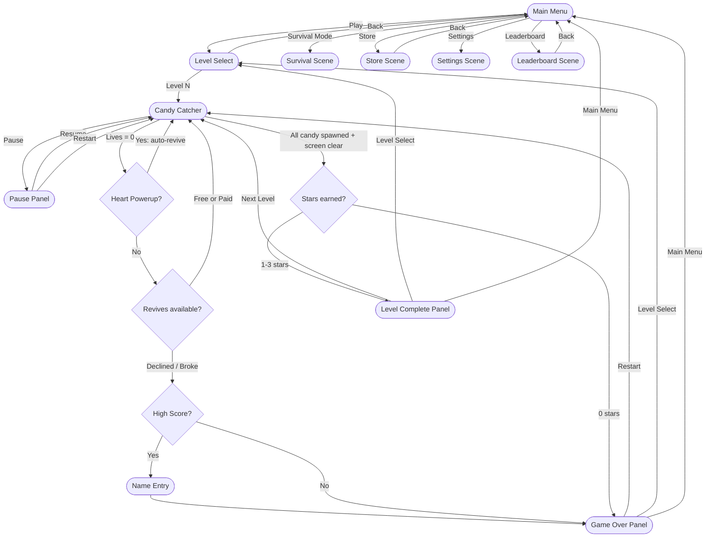
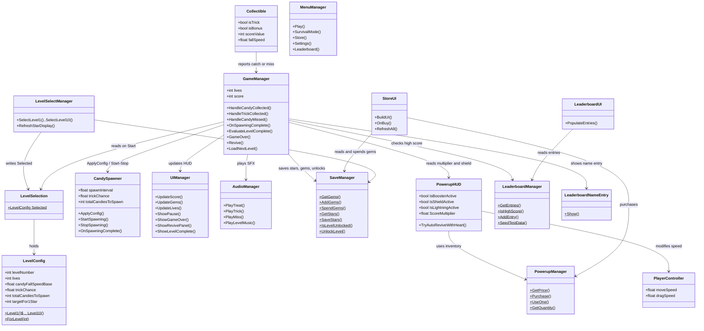
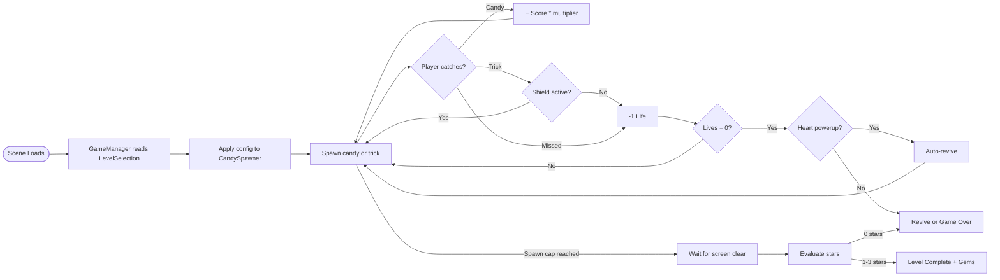

# Candy Catchers

A 2D arcade game built in Unity where you catch falling candy, dodge spooky trick objects, and progress through 10 increasingly difficult levels. Earn stars, collect gems, buy powerups in the store, and compete on the local leaderboard.

---

## Table of Contents

- [Gameplay](#gameplay)
- [Controls](#controls)
- [Game Flow](#game-flow)
- [Level Difficulties](#level-difficulties)
- [Powerup System](#powerup-system)
- [Gem Economy and Star System](#gem-economy-and-star-system)
- [Leaderboard](#leaderboard)
- [Architecture](#architecture)
- [Scripts Overview](#scripts-overview)
- [Project Structure](#project-structure)
- [Persistence](#persistence)
- [MCP / External Systems](#mcp--external-systems)
- [Setup and Installation](#setup-and-installation)
- [Building](#building)
- [Development Notes](#development-notes)
- [TODO / Missing Pieces](#todo--missing-pieces)

---

## Gameplay

Move the catcher left and right at the bottom of the screen to:

- **Catch candy** — earn points (score increases per candy caught)
- **Avoid tricks** (spooky bad candy) — lose a life if you catch one
- **Don't let candy fall off-screen** — each miss costs a life

Each level has a **finite number of candies** to spawn. Survive until spawning ends, then your performance is evaluated with a **1-3 star rating** based on how many candies you caught. Earning at least 1 star unlocks the next level and awards gems.

Powerups purchased from the Store can be activated during gameplay: score multipliers, speed boosts, trick immunity shields, and auto-revive hearts.

If you lose all lives, a **revive panel** offers one free revive per run, then paid revives at 100 gems each. If you decline (or can't afford it), a **high-score name entry** popup appears if you qualify for the top 10.

---

## Controls


| Input                         | Action                  |
| ----------------------------- | ----------------------- |
| `A` / Left Arrow              | Move left               |
| `D` / Right Arrow             | Move right              |
| Click and drag                | Move to cursor position |
| `Escape` / Pause button       | Pause game              |
| Powerup buttons (in-game HUD) | Activate owned powerups |


---

## Game Flow




---

## Level Difficulties

All values are defined as factory methods in `LevelConfig.cs`. Each level has a fixed candy count; the spawner accelerates over time until `minSpawnInterval` is reached.


| Level | Lives | Fall Speed | Trick % | Spawn Interval | Min Interval | Total Candy | 1-Star | 2-Star | 3-Star |
| ----- | ----- | ---------- | ------- | -------------- | ------------ | ----------- | ------ | ------ | ------ |
| 1     | 5     | 2.5        | 10%     | 1.2s           | 0.6s         | 20          | 8      | 14     | 18     |
| 2     | 5     | 2.8        | 12%     | 1.1s           | 0.55s        | 25          | 10     | 17     | 22     |
| 3     | 4     | 3.2        | 15%     | 1.0s           | 0.5s         | 30          | 12     | 20     | 27     |
| 4     | 4     | 3.6        | 18%     | 0.95s          | 0.45s        | 35          | 14     | 24     | 31     |
| 5     | 4     | 4.0        | 20%     | 0.9s           | 0.42s        | 40          | 16     | 28     | 36     |
| 6     | 4     | 4.5        | 23%     | 0.85s          | 0.38s        | 45          | 18     | 31     | 40     |
| 7     | 3     | 5.0        | 25%     | 0.8s           | 0.34s        | 50          | 20     | 35     | 45     |
| 8     | 3     | 5.5        | 28%     | 0.7s           | 0.30s        | 55          | 22     | 38     | 49     |
| 9     | 3     | 6.0        | 30%     | 0.6s           | 0.27s        | 60          | 25     | 42     | 54     |
| 10    | 3     | 7.0        | 35%     | 0.5s           | 0.25s        | 70          | 28     | 49     | 63     |


Star thresholds represent the number of candies the player must catch to earn that rating.

---

## Powerup System

Four powerup types can be purchased in the Store and activated during gameplay via the HUD (bottom-right buttons). Heart is the exception — it triggers automatically on death.


| Powerup      | Price    | Effect                                    | Duration |
| ------------ | -------- | ----------------------------------------- | -------- |
| Booster Pack | 50 gems  | 2x score multiplier                       | 20s      |
| Lightning    | 75 gems  | 2x player movement speed                  | 15s      |
| Shield       | 55 gems  | Immunity to trick damage                  | 10s      |
| Shiny Heart  | 100 gems | Auto-revive on death (restores all lives) | Instant  |


**Activation rules:**

- Timed powerups (Booster, Lightning, Shield) show a countdown timer bar at the top-center of the screen while active
- Only one of each type can be active at a time
- Heart is consumed automatically when the player would die — it fires before the game-over check
- Buttons grey out when the player owns zero of that type
- `PowerupManager` handles inventory persistence via PlayerPrefs; `PowerupHUD` handles in-game UI and effect coroutines

---

## Gem Economy and Star System

**Earning gems:**

- Complete a level with 1 star: **5 gems**
- Complete a level with 2 stars: **15 gems**
- Complete a level with 3 stars: **30 gems**
- Survival mode game over: **5 gems**

**Spending gems:**

- Purchase powerups in the Store (50-100 gems each)
- Paid revive during gameplay: **100 gems**

**Star evaluation** happens after all candies have been spawned and the screen is clear. The number of candies caught is compared against the level's star thresholds. Achieving 0 stars counts as a failure (game over).

**Level unlocking** is sequential — completing level N with at least 1 star unlocks level N+1. Stars are saved persistently and only overwritten if the player earns a higher rating on a subsequent attempt.

---

## Leaderboard

A local top-10 leaderboard stored in PlayerPrefs as JSON via `LeaderboardManager`.

- On game over, if the player's score qualifies for the top 10, a **name entry popup** appears (`LeaderboardNameEntry`)
- Player names are capped at 15 alphanumeric characters
- Ties are broken by date (earlier entry ranks higher)
- The leaderboard scene seeds 8 sample entries on first view if the board is empty
- Accessible from the Main Menu

---

## Architecture

### Script Relationships




### Gameplay Loop




---

## Scripts Overview

### Core Gameplay


| Script                | Class                            | Role                                                                                                                                                                                                                                              |
| --------------------- | -------------------------------- | ------------------------------------------------------------------------------------------------------------------------------------------------------------------------------------------------------------------------------------------------- |
| `GameManager.cs`      | `GameManager`                    | Singleton. Game lifecycle: applies level config, tracks score/lives, handles candy/trick/miss events, triggers level complete or game over, manages revive flow, integrates powerup effects.                                                      |
| `CandySpawner.cs`     | `CandySpawner`                   | Coroutine-based spawner. Drops candy/trick prefabs from random X positions. Spawn interval shrinks over time. Signals `GameManager.OnSpawningComplete()` when the level's candy cap is reached.                                                   |
| `Collectible.cs`      | `Collectible`                    | Attached to every spawned object. Falls via kinematic Rigidbody2D. Notifies GameManager on player collision (candy = score, trick = damage) or screen exit/timeout (candy = miss). Candies spin; tricks wiggle.                                   |
| `PlayerController.cs` | `PlayerController`               | Keyboard (A/D, arrows) and mouse/touch horizontal movement. Lerp-smoothed positioning with screen clamping. Applies tilt rotation and sprite flip based on velocity.                                                                              |
| `LevelConfig.cs`      | `LevelConfig` + `LevelSelection` | `LevelConfig` is a plain C# class with all difficulty variables and star thresholds. Factory methods `Level1()` through `Level10()` return presets. `LevelSelection` is a static bridge — written by `LevelSelectManager`, read by `GameManager`. |


### UI and Menus


| Script                  | Class                | Role                                                                                                                                                                                         |
| ----------------------- | -------------------- | -------------------------------------------------------------------------------------------------------------------------------------------------------------------------------------------- |
| `UIManager.cs`          | `UIManager`          | In-game HUD: score, gems, heart icons, pause/game-over/revive/level-complete panels. All panels are Inspector-wired.                                                                         |
| `MenuManager.cs`        | `MenuManager`        | Main Menu button handlers — routes to Level Select, Survival, Store, Settings, Leaderboard scenes.                                                                                           |
| `LevelSelectManager.cs` | `LevelSelectManager` | Auto-wires buttons by name (`Level1Button`..`Level10Button`, `BackButton`) in `Awake()`. Applies lock/unlock state and star display from `SaveManager`.                                      |
| `SceneManager.cs`       | `SceneLoader`        | Simple scene loading utility. Resets `Time.timeScale` before each load. Note: class is `SceneLoader`, not `SceneManager`, to avoid conflict with `UnityEngine.SceneManagement.SceneManager`. |


### Powerups


| Script              | Class            | Role                                                                                                                                                                                                            |
| ------------------- | ---------------- | --------------------------------------------------------------------------------------------------------------------------------------------------------------------------------------------------------------- |
| `PowerupManager.cs` | `PowerupManager` | Static manager for powerup inventory. Enum of 4 types with prices, display names, descriptions. Persists quantities in PlayerPrefs. Handles purchase (deducts gems via SaveManager) and usage.                  |
| `PowerupHUD.cs`     | `PowerupHUD`     | Runtime in-game HUD (bottom-right buttons, top-center timers). Manages activation coroutines for Booster (2x score), Lightning (2x speed), Shield (trick immunity). Heart auto-revive is called by GameManager. |


### Store


| Script                   | Class                 | Role                                                                                                                                                                                                                               |
| ------------------------ | --------------------- | ---------------------------------------------------------------------------------------------------------------------------------------------------------------------------------------------------------------------------------- |
| `StoreUI.cs`             | `StoreUI`             | Builds the entire Store UI procedurally at runtime: header, gem balance bar, scrollable powerup cards with icons loaded from `Resources/StoreImages/`, buy buttons, back navigation. Mobile portrait layout (1080x1920 reference). |
| `StoreSceneBootstrap.cs` | `StoreSceneBootstrap` | Ensures `StoreUI` and `EventSystem` exist when StoreScene loads. Uses `RuntimeInitializeOnLoadMethod` + `Awake()`.                                                                                                                 |


### Leaderboard


| Script                         | Class                       | Role                                                                                                                                                               |
| ------------------------------ | --------------------------- | ------------------------------------------------------------------------------------------------------------------------------------------------------------------ |
| `LeaderBoardManager.cs`        | `LeaderboardManager`        | Static manager for local top-10 scores. JSON-serialized in PlayerPrefs. Provides `IsHighScore()`, `AddEntry()`, `SeedTestData()` (8 sample entries on first view). |
| `LeaderBoardUI.cs`             | `LeaderboardUI`             | Procedurally builds the leaderboard display: styled scrollable list with rank medals (gold/silver/bronze), player names, scores. Seeds test data if empty.         |
| `LeaderBoardNameEntry.cs`      | `LeaderboardNameEntry`      | Self-contained popup overlay for high-score name entry. Static `Show(score, callback)` API. 15-char alphanumeric input, submit or skip.                            |
| `LeaderBoardSceneBootstrap.cs` | `LeaderboardSceneBootstrap` | Ensures `LeaderboardUI` and `EventSystem` exist when LeaderboardScene loads.                                                                                       |


### Persistence and Utilities


| Script            | Class          | Role                                                                                                                                                                        |
| ----------------- | -------------- | --------------------------------------------------------------------------------------------------------------------------------------------------------------------------- |
| `SaveManager.cs`  | `SaveManager`  | Static helper for PlayerPrefs persistence: gem balance, per-level star ratings (only overwrites if improved), level unlock flags.                                           |
| `AudioManager.cs` | `AudioManager` | Singleton with `DontDestroyOnLoad`. Manages background music (per-level tracks for levels 4-7, default for others) and one-shot SFX (randomized treat sounds, trick, miss). |
| `ObjectPool.cs`   | `ObjectPool`   | Generic prefab pool with `Get()`/`ReturnToPool()`. Currently unused — `CandySpawner` uses `Instantiate` directly.                                                           |


---

## Project Structure

```
Assets/
├── Scenes/
│   ├── Main Menu.unity              # Start screen with Play, Survival, Store, Settings, Leaderboard
│   ├── Level Select.unity           # 10-level grid with lock/unlock and star display
│   ├── Candy Catcher.unity          # Main gameplay scene (in Scenes/Sprite Assets/)
│   ├── StoreScene.unity             # Powerup store (UI built at runtime by StoreUI)
│   ├── LeaderboardScene.unity       # Top-10 display (UI built at runtime by LeaderboardUI)
│   ├── SettingsScene.unity          # Settings (no dedicated script yet)
│   ├── SurvivalScene.unity          # Endless/survival mode (partially implemented)
│   └── Sprite Assets/               # Sprite sub-assets for scenes
├── Scripts/
│   ├── GameManager.cs               # Core game state and lifecycle
│   ├── CandySpawner.cs              # Falling object spawner
│   ├── Collectible.cs               # Per-object catch/miss/trick behaviour
│   ├── PlayerController.cs          # Player input and movement
│   ├── LevelConfig.cs               # Difficulty presets (10 levels) + LevelSelection bridge
│   ├── LevelSelectManager.cs        # Level select button auto-wiring and star display
│   ├── MenuManager.cs               # Main menu navigation
│   ├── SceneManager.cs              # Scene loading utility (class: SceneLoader)
│   ├── UIManager.cs                 # In-game HUD panels
│   ├── AudioManager.cs              # Music and SFX singleton
│   ├── SaveManager.cs               # PlayerPrefs persistence (gems, stars, unlocks)
│   ├── PowerupManager.cs            # Powerup inventory and purchase logic
│   ├── PowerupHUD.cs                # In-game powerup buttons and timers
│   ├── StoreUI.cs                   # Procedural store UI builder
│   ├── StoreSceneBootstrap.cs       # StoreScene initializer
│   ├── LeaderBoardManager.cs        # Local leaderboard data (top-10, JSON)
│   ├── LeaderBoardUI.cs             # Leaderboard display builder
│   ├── LeaderBoardNameEntry.cs      # High-score name entry popup
│   ├── LeaderBoardSceneBootstrap.cs # LeaderboardScene initializer
│   └── ObjectPool.cs                # Generic prefab pool (unused)
├── Resources/
│   ├── Backgrounds/                 # Per-level background sprites (Level3BG..Level6BG)
│   ├── BGM/                         # Music: DefaultBGM + Level4BGM..Level7BGM
│   ├── Icons/                       # UI icons (play, pause, settings, etc.)
│   ├── StoreImages/                 # Powerup card images (Booster, Lightning, Heart, Shield, Gem)
│   └── Animations/                  # PausePanel animation controller
├── Sprites/                         # Candy prefabs (Candies_*) and trick prefabs (BadSpooky Candy_*)
├── Spriites/                        # Additional animations/controllers (typo in folder name)
├── Transparent UI/                  # Background and UI art (PNGs/JPGs)
├── TextMesh Pro/                    # TMP package: fonts, shaders, examples
├── Settings/
│   ├── Build Profiles/              # Android build profile
│   └── URP/                         # Render pipeline assets, volume profiles
├── TutorialInfo/                    # URP template readme asset and editor scripts
└── ProjectSettings/                 # Unity project configuration
```

---

## Persistence

All persistence uses `PlayerPrefs` (no external database or cloud save).


| Key Pattern         | Type   | Description                                                          |
| ------------------- | ------ | -------------------------------------------------------------------- |
| `TotalGems`         | int    | Player's gem balance                                                 |
| `Level_N_Stars`     | int    | Best star rating for level N (1-3, 0 = unplayed)                     |
| `Level_N_Unlocked`  | int    | 1 if level N is accessible, 0 otherwise. Level 1 is always unlocked. |
| `Powerup_Booster`   | int    | Owned quantity of Booster powerups                                   |
| `Powerup_Lightning` | int    | Owned quantity of Lightning powerups                                 |
| `Powerup_Heart`     | int    | Owned quantity of Heart powerups                                     |
| `Powerup_Shield`    | int    | Owned quantity of Shield powerups                                    |
| `Leaderboard_JSON`  | string | JSON-serialized top-10 leaderboard entries                           |


---

## MCP / External Systems

This project has **MCP for Unity** (Model Context Protocol) configured, which allows AI coding assistants (GitHub Copilot, Cursor) to interact directly with the Unity Editor at runtime — reading/modifying scenes, creating GameObjects, wiring components, running tests, and reading console output.

**Package:** `com.coplaydev.unity-mcp` installed via git URL:

```
https://github.com/CoplayDev/unity-mcp.git?path=/MCPForUnity#main
```

**Transport:** HTTP/SSE server running at `http://127.0.0.1:8080/mcp` inside the Unity Editor.

**Capabilities:** Scene hierarchy manipulation, UI creation, script management, prefab operations, Play mode control, console log access, animation editing.

See [MCP_SETUP.md](MCP_SETUP.md) for full setup instructions (one-time config, daily workflow, what requires manual work).

See [UNITY_GOTCHAS.md](UNITY_GOTCHAS.md) for a log of real problems encountered during development (sprite fileID issues, MCP-created UI scale bugs, button wiring pitfalls, git phantom changes, and more).

---

## Setup and Installation

### Requirements

- **Unity 6** (6000.3.11f1 or later)
- **Unity Hub 3.x**
- Universal Render Pipeline (URP) — included in project packages

### Running the Project

1. Clone or download the repository
2. Open **Unity Hub** → **Open** → select the project root folder
3. Unity will import all assets automatically (first open may take a few minutes)
4. Open `Assets/Scenes/Main Menu.unity`
5. Press **Play**

> `Library/`, `Temp/`, `Logs/`, and `UserSettings/` are auto-generated by Unity and excluded via `.gitignore`. Unity recreates them on first open.

### Key Package Dependencies


| Package                   | Version            |
| ------------------------- | ------------------ |
| Universal Render Pipeline | 17.3.0             |
| Input System              | 1.19.0             |
| TextMesh Pro              | (built-in via URP) |
| Unity UI (uGUI)           | 2.0.0              |
| MCP for Unity             | git (main branch)  |
| 2D Sprite                 | 1.0.0              |
| Timeline                  | 1.8.11             |


---

## Building

1. **File → Build Settings**
2. Ensure all game scenes are listed and enabled:
  - `Main Menu`
  - `Level Select`
  - `Candy Catcher`
  - `StoreScene`
  - `LeaderboardScene`
  - `SettingsScene`
  - `SurvivalScene`
3. Select your target platform (Android build profile is pre-configured)
4. Click **Build**

> **Important:** `Main Menu` should be index 0 in the build scene list so it loads first.

---

## Development Notes

- **Button auto-wiring:** `LevelSelectManager` finds buttons by exact GameObject name (`Level1Button`..`Level10Button`, `BackButton`). Renaming these objects will break the wiring.
- **Procedural UI:** Store, Leaderboard, and PowerupHUD scenes build their entire UI at runtime via code — no prefab drag-and-drop required. This makes them resilient to scene corruption but harder to visually tweak.
- **AudioManager singleton** uses `DontDestroyOnLoad` and persists across all scene loads. Duplicate AudioManager instances in scenes are automatically destroyed.
- **SceneLoader vs SceneManager:** The file `SceneManager.cs` defines a class named `SceneLoader` to avoid collision with `UnityEngine.SceneManagement.SceneManager`.
- **Portrait orientation:** The project is configured for portrait-only (landscape autorotation disabled). CanvasScalers use `matchWidthOrHeight: 0.5` with 1080x1920 or 800x700 reference resolutions.
- **Per-level music:** Levels 4-7 have dedicated BGM tracks loaded from `Resources/BGM/`. All other levels use `DefaultBGM`.
- **Per-level backgrounds:** Loaded at runtime from `Resources/Backgrounds/` and applied to the `BG_sample_0` GameObject's SpriteRenderer.
- **Revive flow:** First revive per run is free. Subsequent revives cost 100 gems. Heart powerup fires before the revive panel (auto-consumes).
- **ObjectPool** exists but is not currently used — `CandySpawner` instantiates/destroys directly. Available for future optimization.

See [UNITY_GOTCHAS.md](UNITY_GOTCHAS.md) for a detailed log of pitfalls and fixes encountered during development.

---

## TODO / Missing Pieces

- **SettingsScene** — the scene file exists and is routable from the Main Menu, but no dedicated settings script was found. Likely needs audio volume controls, screen orientation options, or data reset. *Needs implementation.*
- **SurvivalScene** — the scene exists and `MenuManager.SurvivalMode()` loads it. `GameManager` awards 5 gems on survival game over. However, there is no survival-specific spawner configuration (no `LevelConfig` preset for survival mode). *Needs a dedicated endless config or separate spawner logic.*
- **ObjectPool** — implemented but unused. `CandySpawner` uses `Instantiate`/`Destroy`. Integrating the pool would reduce GC pressure on longer levels.
- **Backgrounds for levels 1-2 and 7-10** — `Resources/Backgrounds/` contains `Level3BG` through `Level6BG`. Other levels fall through silently (no error, just no background swap). *Needs additional background assets.*
- **BGM for levels 1-3 and 8-10** — `Resources/BGM/` contains `Level4BGM` through `Level7BGM`. Other levels use `DefaultBGM`. *May need additional tracks or may be intentional.*
- **Duplicate scene file** — `Assets/CandyCatcher.unity` at the project root appears to duplicate `Assets/Scenes/Candy Catcher.unity`. Confirm which is used in Build Settings and remove the other.
- **Folder typo** — `Assets/Spriites/` (double 'i') contains animations and controllers. Consider renaming to `Assets/Sprites/Animations/` or similar.

---

## Version

Unity 6000.3.11f1 — Universal Render Pipeline (URP)